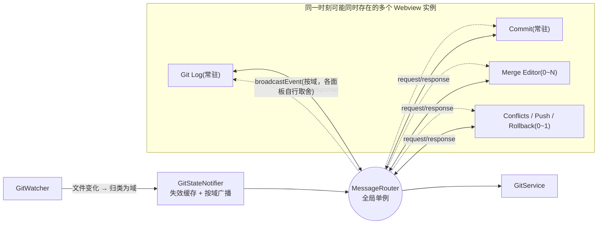
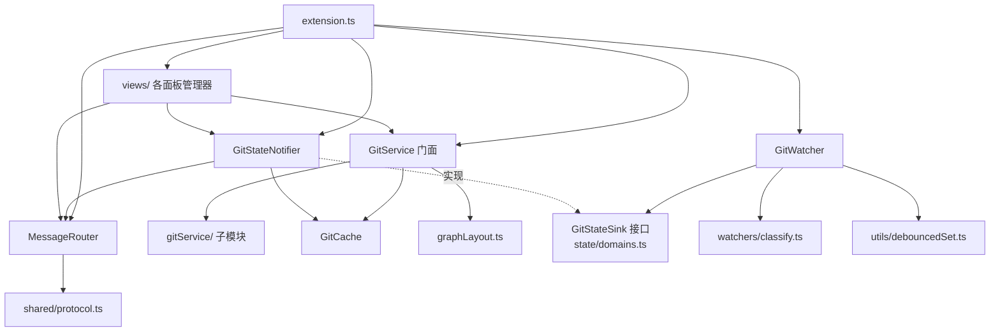
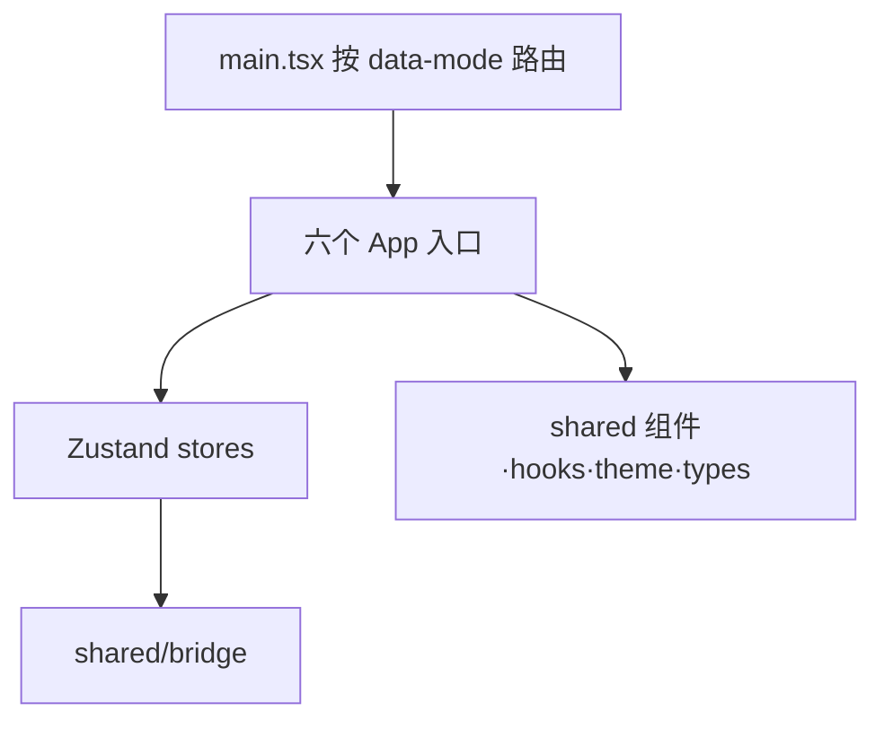

# 架构与设计思路

> 本文记录当前工程的架构分层与关键设计决策的**动机**（而非仅描述代码结构），便于后续维护者理解"为什么这么做"。

## 一、产品定位决定了架构形态

这是一个"把 JetBrains/IDEA 的 Git 体验搬进 VS Code"的插件，不是重新发明一套 Git UI。这个定位直接导致了几个关键设计选择：

- **多个独立面板而不是一个大而全的视图**：Git Log 面板、Commit 面板（含 Shelf/IDEA Shelf）、3-way Merge Editor、Conflicts 列表、Push 对话框、Rollback 面板——对应 IDEA 里真实存在的多个工具窗口，而不是塞进一个 webview。
- **专门实现 IDEA 风格的 Shelf**（区别于标准 `git stash`）：`.idea/shelf/<name>/shelved.patch`，甚至手写了 IDEA patch 格式的解析器（`parseIdeaPatchForFile` / `applyUnifiedDiff`，见 `src/extension.ts`）来还原 base/modified 内容用于 diff。这是为了让从 IDEA 迁移过来的用户行为习惯一致，而不是"能用 stash 顶替就行"——工程量换来的是产品体验上的一致性。

## 二、主机—Webview 分离，但用"单一路由"复用前端产物

- 扩展主机（`src/`）只做数据与副作用：调 Git CLI、监听文件系统、调用 VS Code API（弹窗、diff editor、剪贴板）。
- Webview（`webview/`）是纯 React 前端，**只有一个 Vite 构建产物**（`dist/webview/assets/main.js`），通过 `data-mode` 属性在 `webview/src/main.tsx` 里路由到 `panel | merge | conflicts | commit | push | rollback` 六个 App 之一，`src/views/html.ts` 统一生成骨架 HTML。

这个设计的意图很清楚：**避免为每个 webview 面板单独维护一套构建配置**。所有面板共享 `webview/src/shared/` 下的 bridge、类型、组件、主题，只是入口 App 不同，构建/发布链路简化为一次 `vite build`。

## 三、通信层：类型化的请求/响应 + 广播事件，单一 MessageRouter

`MessageRouter`（`src/messages/messageRouter.ts`）是全局唯一实例，消息结构、命令名（`CommandType`）、事件名（`EventType`）定义在 `shared/protocol.ts` 这一份文件里，扩展主机和 webview 都直接 import 它（两边 tsconfig 都 include），不存在"两份需要手动同步"的问题。



- **request/response（实线，一问一答）**：webview 发 `{type:"request", id, command, params}`，主机异步处理后按 `id` 回一个 `response`，天然支持 `Promise` 化（`vscode-bridge.ts` 用 `pendingRequests` Map + 10s 超时）。
- **event 广播（虚线，一对多、无回执）**：git 状态是一个域一个事件——`refsChanged` / `worktreeChanged` / `stashChanged` / `operationChanged`（域的划分见第六节）；此外还有几个与 git 状态无关的 UI 事件：`busyStart` / `busyEnd`（顶部进度条，刻意跟 git 的「进行中操作」区分开）、`showFileHistory`、`rollbackPanelInit`。传输层仍然是无差别群发给所有 webview，但事件名本身已经携带了「变的是哪一类数据」，接收方按事件名订阅自己关心的那部分。`EventPayloads`（`shared/protocol.ts`）把事件名和 payload 形状绑在编译期，webview 侧的订阅因此是判别联合而不是裸字符串比较。
- **新增一个面板不需要新建通信通道**：`MergeEditorManager` / `ConflictsManager` / `PushPanel` 都只是 `messageRouter.registerWebview(panel.webview)` 一行代码接入星型拓扑，`MessageRouter` 本身逻辑不用改。
- 仍然存在的类型空洞：`Bridge.request(command, params)` 里 `params` 是 `Record<string, unknown>`、返回值是 `Promise<unknown>`，编译器不校验"某个命令该传什么参数、返回什么"，这一层还是靠约定而非类型系统。

## 四、Git 数据层：直接调 CLI，而非 simple-git/isomorphic-git

`src/git/gitService.ts` 是门面，实际实现拆分在 `src/git/gitService/` 下按领域分的子模块（`branches` / `log` / `remote` / `mergeRebase` / `stash` / `ideaShelf` / `status` / `diff` / `parsers` 等），统一通过 `execFile` 直调 `git`，自定义 `\x00` / `\x00\x00\x01` 作为字段/记录分隔符解析 `git log --format=...`。这是一个经过取舍的设计：

- 不引入 `simple-git` 这类封装库的解析开销和不确定行为，命令、参数、输出格式完全自己掌控，方便对齐 IDEA 的展示细节（比如 mailmap 解析的 `%aN` / `%aE`）。
- 所有执行都过统一的 `runGit` 记录到一个 Output Channel（带耗时、stderr），排查用户环境里的 Git 行为差异时很关键；`index.lock` 相关的报错也在这一层被识别并转换成友好提示，而不是把英文原始报错丢给用户。

## 五、图形布局算法：贪心车道分配 + 快照续接

`src/git/graphLayout.ts` 的 `computeGraphLayout` 是全项目最"硬核"的自研部分：

- **贪心车道分配**：用 `activeLanes` 数组模拟每条"车道"当前等待的 commit hash，遇到已知 hash 复用车道，否则找空位或新增车道，处理 fork/merge/straight 三种连线类型。
- **LaneSnapshot 跨分页稳定性**：专门为"虚拟滚动 + 分页加载历史"设计——`loadMore` 时把上一批的 `activeLanes` / `laneColors` / `nextColorIndex` 传回后端续算，保证滚动加载更多提交时车道颜色和位置不跳变，而不是每次全量重算。
- **渲染选择 SVG+DOM 而非 Canvas**：牺牲一些绘制性能，换取可以直接用 React 组件叠加 tooltip、选中态、hover 高亮，并复用 VS Code 主题 CSS 变量做暗色/亮色适配。

## 六、状态一致性：GUI 不持有状态，只持有"上一次的快照"

这套架构要解决的核心问题是：**用户完全可能在终端里直接敲 git 命令，GUI 必须能自动感知并纠正自己**，而不是维护一份可能与磁盘漂移的本地模型。拆成五层机制：

1. **缓存只在后端，短命、被动失效**：webview 侧 Zustand store（`panel-store` / `commit-store` / `merge-store`，每个面板一个）里的 `commits` / `branches` 等不是"缓存"，只是"上一次读到的快照给 React 渲染用"，没有 TTL、不持久化。唯一带 TTL 的缓存是后端 `GitCache`（`src/git/cache.ts`，默认 5s），只用来挡住同一次交互里多个组件对同一 git 命令的重复请求。
2. **感知变化靠 OS 文件事件，不轮询**：`GitWatcher`（`src/watchers/gitWatcher.ts`）只建**两个** `FileSystemWatcher`，外加一个编辑器保存监听：

   - **源 A——`.git` 内部的元数据**：以 `Uri` 为 base 建 `RelativePattern`，这样得到的是独立 watcher，**不受 `files.watcherExclude` 影响**。用户很可能配了 `**/.git/**` 把整个 `.git` 排掉（常见的性能优化），换成字符串 pattern 会一个事件都收不到。代价是默认的 `**/.git/objects/**` 排除也保护不到，噪声得自己在 `classifyGitPath` 里挡（`objects/` 在一次 fetch 里能刷出成千上万个事件）。
   - **源 B——工作区文件本身**：反过来，**必须**用字符串 pattern，这样 VSCode 会复用已有的 workspace watcher 并尊重 `files.watcherExclude`（默认已排除 `node_modules`），增量开销只是事件分发；换成 `RelativePattern` 就会新建一个不受排除约束的 watcher，大仓库下会被构建产物淹掉。改一个文件不会碰 `.git` 里的任何东西，所以这条是工作区改动**唯一**的信号来源。
   - **源 C——`onDidSaveTextDocument`**：源 B 已经覆盖了这种情况，留着纯粹是因为文件系统事件有几十到几百毫秒延迟，这条更跟手，成本几乎为零。

   **两个 watcher 对 `files.watcherExclude` 的要求正好相反，这是唯一需要拆开的理由**；除此之外一律靠 `classify.ts` 里的纯函数区分，不靠加 watcher。路径到域的映射收敛成一张可以脱离 vscode 单独测试的表（`classifyGitPath`）——这张表是整个 watcher 里变化最频繁的部分，每发现一个没覆盖到的 git 文件就加一行，而不是再建一个 watcher。表的末尾对没见过的文件返回"刷新"而不是"丢弃"：真正的噪声大头在开头就挡掉了，剩下的未知文件都是低频的，宁可多刷一次也别漏。

   多根工作区下每个仓库都要监听，且 `.git` 的真实位置要用 `git rev-parse --absolute-git-dir` 问出来——在 git worktree 和 submodule 里 `.git` 是个指向别处的**文件**而不是目录，盯错了一个事件都收不到。

   终端敲的 git 命令和面板点按钮触发的写操作，改的是完全相同的文件，对 `GitWatcher` 来说没有区别。
3. **变化按"域"分类，订阅方只重拉自己关心的那部分**：分成 `refs`（分支 / tag / 提交图）、`worktree`（工作区改动 + 暂存区）、`stash`（shelf 与 IDEA shelf 列表）、`operation`（merge / rebase / cherry-pick 的进行中状态）四个域，定义和对照表在 `src/state/domains.ts`。

   **域是按"下游要重新拉什么"倒推出来的，不是按 git 自己的概念划的**。最主要的收益是：纯工作区文件改动只给 `worktree`、绝不给 `refs`——否则保存一次文件就要重拉 200 条提交并重算整张车道布局，而这是四个域里代价最高的一个。另一条容易搞错的边界是 `.git/index` 只算 `worktree`：`git status` 自己就会回写 index 刷新 stat 缓存，若把它算进 refs，会形成 status → 写 index → 重拉 → 又跑 status 的回路。

   挑域的原则是"宁可多给一个也不要漏"——漏了是界面不刷新，多给只是多跑一次查询。域这个概念只存在于扩展主机侧，webview 按事件名订阅、不需要知道有"域"，所以 `GitDomain` 不出现在 `shared/protocol.ts` 里。
4. **收到"变了"后永远整体重拉，不做增量合并**：`文件变了 → classifyGitPath 归类出域 → DebouncedSet 聚合 → GitStateNotifier 失效缓存 + 按域广播`。防抖是 trailing debounce + maxWait（`src/utils/debouncedSet.ts`）：事件持续涌入时不断推迟，流停下来 300ms 后触发一次，所以像 checkout 那样的事件洪峰只换来一次回调；但持续不断的事件流不能把回调饿死，从本轮第一项算起最多憋 2s 就必须刷一次。

   store 收到事件后整体重新请求该域对应的数据（`getGraphData` / `getBranches` / `getWorkingTreeChanges` / `getShelves`...），不写"把 diff 打到现有 state 上"的增量逻辑——代价是多一次 IPC 往返，换来的是每次都自愈，不管之前状态多离谱，下一次事件一来就被真实数据覆盖。注意"整体"是**限定在域内**的：一个 `worktreeChanged` 只会让 Commit 面板重跑一次 `git status`，不会惊动提交图。

   广播出口收口在 `GitStateNotifier`（`src/state/gitStateNotifier.ts`）这一个类里，目的是把"失效缓存"和"广播事件"绑死——在此之前两者散落在各个 handler 里，有的 invalidate 了才广播、有的直接广播靠 watcher 兜底。缓存目前一律整体失效，没有按域细化：现在缓存的粒度跟域对不上（比如工作区改动要重拉的 `getWorkingTreeChanges` 根本不走缓存），细化没有实际收益。
5. **中间态、操作结果不是自己记的，是每次现查，且没有乐观更新**：`isMerging` / `isRebasing` / `isCherryPicking` 每次都实际读 `.git/MERGE_HEAD`、`.git/rebase-merge/` 等文件是否存在。点"删除分支"不会立刻从列表划掉，而是 `busyStart`（`withProgress` 显示顶部进度条）→ 真正执行 git 命令 → 文件系统真的变了 → watcher 触发 → 拿到真实结果后才刷新列表。危险操作（`deleteBranch`、`rollbackFile`、`deleteShelve`、`dropCommit`、`deleteFiles`）都有二次确认，最终也都落到 `showWarningMessage(..., {modal:true})`，但**发起方分散在两处**：多数是前端调 `showConfirmMessage` 这个通用转发 handler 弹的，另有若干 handler（`rollbackFile`、以及 `updateBranch` 在 `BranchDivergedError` 之后让用户选 Merge 还是 Rebase）直接在后端弹。两头都有属于历史遗留，代价是确认文案和交互形态没有单一收口点。`bridgeWithProgress` 强制最少 1 秒展示时长，避免 loading 闪一下就消失。

读写两条链路串起来看：

```
读路径：.git/ + 工作区 → GitService(execFile) → GitCache(5s) → messageRouter.handle
        → response → vscode-bridge(按 id resolve) → Zustand store → React 重渲染

写路径：用户点击 → store action → bridge.request → messageRouter.handleRequest
        → GitService.xxx() → 磁盘状态改变 → （不直接改 store！）

更新触发：GitWatcher 监测到文件变化并归类出域 —或— handler 执行完显式声明自己影响哪些域
        → 两条路径都汇入 GitStateNotifier.notify(...domains)
        → 失效缓存 + 按域 broadcastEvent → bridge.onEvent
        → 订阅了该事件的 store 重新走一遍"读路径"
```

也就是说写操作只负责改磁盘 + 声明"哪个域变了"，UI 怎么更新永远统一走读路径重新整体拉一遍——不存在把 mutation 返回值直接 patch 进 store 的写法。这正是为什么面板按钮触发的写和终端手动敲命令触发的写最终收敛到同一条更新路径：右键删分支的 handler 调 `notify(GitDomain.Refs)`，终端里敲 `git branch -d` 则由 watcher 从 `refs/heads/**` 的变化归类出同一个 `refs` 域，两者广播出的都是 `refsChanged`，Git Log 面板根本不区分这次刷新是谁引起的。

handler 那次主动通知只是为了免去等 watcher 防抖的那 300ms，**所以同一次 git 操作会被 handler 和 watcher 各通知一次，`notify` 的实现必须幂等**——这也是 `GitStateSink` 接口上写明的约定。顺带一提，`GitWatcher` 依赖的是 `GitStateSink` 这个接口而不是 `GitStateNotifier` 实现：一是让依赖指向更稳定的一侧，二是让 watcher 的分类/防抖逻辑可以脱离 `MessageRouter` 单独测。

**已知边界**：这套模式的前提是变化必须落在被监听的路径上，而源 B 为了复用 VSCode 已有的 workspace watcher，是**尊重 `files.watcherExclude` 的**。于是被用户的排除规则挡掉的目录里，如果有 git 跟踪的文件发生改动，`git status` 看得见、界面却不会刷新。这是拿"大仓库下不被构建产物淹掉"换来的，属于有意的取舍而非疏漏；`git-brains.refreshLog` 命令可以手动全域刷新兜底。FileSystemWatcher 本身在网络盘、容器挂载、WSL 跨文件系统等场景下丢事件也是已知问题，同样靠这个命令兜底。

## 七、三方合并编辑器：diff3 + 二次 diff 精细化

`webview/src/conflicts/utils/merge-logic.ts` 里先用 `node-diff3` 的 `diff3MergeRegions` 得到粗粒度的 equal/conflict 块，然后对**每个 conflict 块**再跑一次 `diffArrays`（二方 diff）拆成更细的 sub-block。动机：diff3 在 base 为空（比如 cherry-pick 场景没有真实公共祖先）时会把本该相同的内容一股脑归进一个大冲突块，体验很差。这是典型的"发现现成算法在某个场景下体验不好，针对性叠加一层后处理"的务实设计，而不是重新造一个 diff 算法。

## 八、模块拓扑图（静态依赖关系）

这张图展示的是"谁 import 谁"的静态依赖，分别对应 `src/`（扩展主机）和 `webview/src/`（前端），两边之间没有任何直接 import——唯一的连接点是运行时的 postMessage 通道（`MessageRouter` ↔ `bridge`）。消息结构和命令名靠共享的 `shared/protocol.ts` 保证类型一致，但 `params`/返回值的具体形状仍是约定而非类型（见第三节）。

**扩展主机 `src/`**



注意 `WATCH --> SINK` 这条虚接缝：`GitWatcher` 依赖的是 `GitStateSink` **接口**，不是 `GitStateNotifier` 实现（后者反过来实现前者，图里的虚线）。这样 watcher 既不认识 `MessageRouter` 也不认识 `GitCache`，分类与防抖逻辑可以脱离 vscode 单独测试。

**Webview 前端 `webview/src/`**



**每个分组节点包含的具体文件**：

| 分组节点 | 具体文件 |
|---|---|
| `VIEWS`（views/ 各面板管理器） | `gitLogViewProvider.ts`（常驻侧边栏）、`commitViewProvider.ts`（常驻侧边栏）、`mergeEditorManager.ts`（按需创建，可多实例）、`conflictsManager.ts`、`diffEditorManager.ts`、`pushPanel.ts`、`rollbackPanel.ts`、`gitContentProvider.ts`、`html.ts`（统一生成 webview 骨架 HTML，被前 6 者共用） |
| `SUB`（gitService/ 子模块） | `branches.ts` / `log.ts` / `remote.ts` / `mergeRebase.ts` / `stash.ts` / `ideaShelf.ts` / `status.ts` / `diff.ts` / `parsers.ts` / `context.ts` / `constants.ts` / `errors.ts` |
| `SINK` / `NOTIFY`（state/） | `domains.ts`（`GitDomain` 四个域的定义与对照表、域 → 事件名映射 `DOMAIN_EVENT`、`GitStateSink` 接口）、`gitStateNotifier.ts`（唯一广播出口，失效缓存 + 按域广播） |
| `WATCH`（watchers/） | `gitWatcher.ts`（两个 FileSystemWatcher + 编辑器保存监听）、`classify.ts`（路径 → 域的纯函数映射表，不依赖 vscode） |
| `APPS`（六个 App 入口） | `panel/App.tsx`、`commit/App.tsx`、`conflicts/App.tsx`、`conflicts/MergeStandaloneApp.tsx`、`push/App.tsx`、`rollback/App.tsx` |
| `STORES`（Zustand stores） | `shared/store/panel-store.ts`（→ panel）、`shared/store/commit-store.ts`（→ commit）、`shared/store/merge-store.ts`（→ conflicts / merge） |
| `SHARED`（shared 组件·hooks·theme·类型） | `shared/components`、`shared/hooks`、`shared/theme`、`shared/types`、`shared/bridge` |

## 九、已知限制与后续改进方向

### `updateBranch` 对 Git < 2.27 支持不完整（`--autostash` 版本兼容）

**现状**：`src/git/gitService/remote.ts`（`updateBranch`）里 `merge --autostash`、`merge --ff-only --autostash` 直接使用 `--autostash`。这个 flag 用在 `git merge`（含走 merge 策略的 pull）是 **Git 2.27**（2020-06）才加入的；`git rebase --autostash` 则从 **Git 2.6**（2015）就支持。代码里没有版本探测，也没有针对老版本的降级路径——机器上的 Git 低于 2.27 时，走 merge 的分支会直接抛出 `unknown option '--autostash'`，且报错是原始英文，没有像第四节里 `index.lock` 那样做过友好化。

**参考实现**：VS Code 内置 Git 插件用 `compareGitVersionTo('2.27.0')` 判断，≥2.27 走原生 `--autostash`（`extensions/git/src/git.ts:2462-2464`），<2.27 则用 `maybeAutoStash()` 包一层"手动 stash → 执行 → `finally` 里无条件 pop"（`extensions/git/src/repository.ts:3159-3175`）。它把 pop 放进 `finally`，不区分操作是成功还是冲突失败，靠的是 `git stash pop` 在 apply 失败时不会丢弃 stash 条目这个安全特性兜底——冲突就冲突，stash 记录还在，顶多让用户多处理一层，不会丢改动。

**计划的改进方向**（比 VS Code 的简化做法更"干净"，暂不实现，先记录）：不满足于"`finally` 里无脑 pop"，而是把 stash 的生命周期和 merge/rebase"是否进入冲突态"显式绑定，手动控制完整的四个阶段：

1. **发起阶段**（`updateBranch`）：探测到老版本 Git 时，先手动 `git stash`（含 untracked），再执行不带 `--autostash` 的 `merge`/`rebase`。
2. **成功路径**：merge/rebase 直接成功 → 立即 pop 回来，行为等价于原生 `--autostash`。
3. **失败进入冲突态**：这一步**不 pop**——工作区此时已经处于冲突态，贸然 pop 等于在一个冲突基础上再叠一层 stash 冲突。把"存在一个待归还的 stash"这件事记下来即可（可以靠一个约定的 stash message 识别，而不需要额外持久化状态，呼应第六节"不持有状态、每次现查"的原则）。
4. **收尾阶段**（`rebaseAction("continue"/"abort")`、`mergeContinue()`、`mergeAbort()`）：这几个方法执行完、工作区回到无冲突状态之后，检查是否存在第 3 步留下的那个约定 stash，如果有，这时候才 pop 回来。

这样任何一次 pop 都发生在"工作区已确认无冲突"之后，不依赖 `git stash pop` 失败不丢数据这个安全网兜底，而是从源头上避免制造"冲突叠冲突"的中间态；代价是要跨 `updateBranch` / `rebaseAction` / `mergeContinue` / `mergeAbort` 四个方法协调状态，比 VS Code 的一层 `try/finally` 包装工作量更大。

### 已修复项（备忘）

- `git gc` / `git pack-refs` 之后分支变化收不到：ref 被打包进 `.git/packed-refs` 以后，对它的更新不再写 `refs/heads/*` 松散文件。`classifyGitPath` 已把 `packed-refs` 归入 `refs` 域（同批补上的还有 `config`、`FETCH_HEAD`、`ORIG_HEAD`、`REBASE_HEAD` 以及 worktree / submodule 目录）。
- `git stash drop` / `stash clear` 只改 `refs/stash` 不碰 `index`：`classifyGitPath` 里 `refs/stash` 与 `logs/refs/stash` 归入 `stash` 域，且这两条判断必须排在 `refs/` 和 `logs/` 的前缀判断之前。
- 终端和面板抢 `.git/index.lock` 时报错是原始英文：已在 `gitService.ts` 里识别 `index.lock` 报错并转换为友好提示（注意这只是文案层面的改善，没有引入重试/排队逻辑，并发写入冲突仍靠 git 自身锁机制兜底）。
